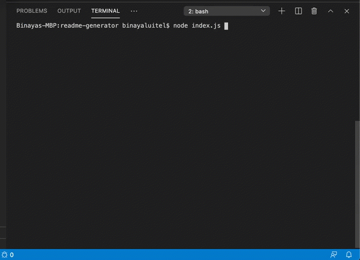

## Description 
   
  This project is intended generate a good ReadME file for GitHub project in an automated way. 

  ## Table of Contents
  * [Installation](#installation)
  * [Usage](#usage)
  * [Contributing](#contributing)
  * [Tests](#tests)
  * [License](#license)
  
  ## Installation
    
  Navigate inside the folder and run `npm install`. This will install all the dependencies from package.json file.
  
  ## Usage 
  
  Please refer to the attached video for the usage.
  
  
  
  ## Contributing
  
  Binaya Luitel
  
  ## Tests  
  
  There are no tests at the moment.
  
  ## License
  
  MIT License
  
